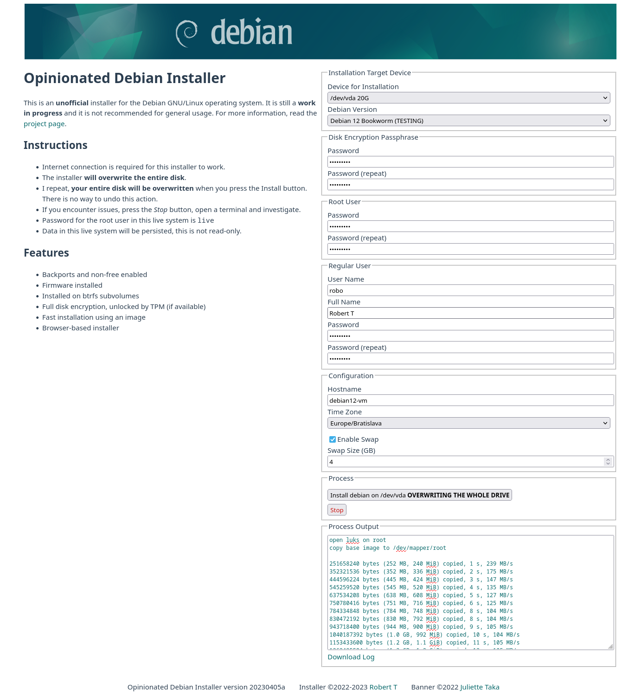
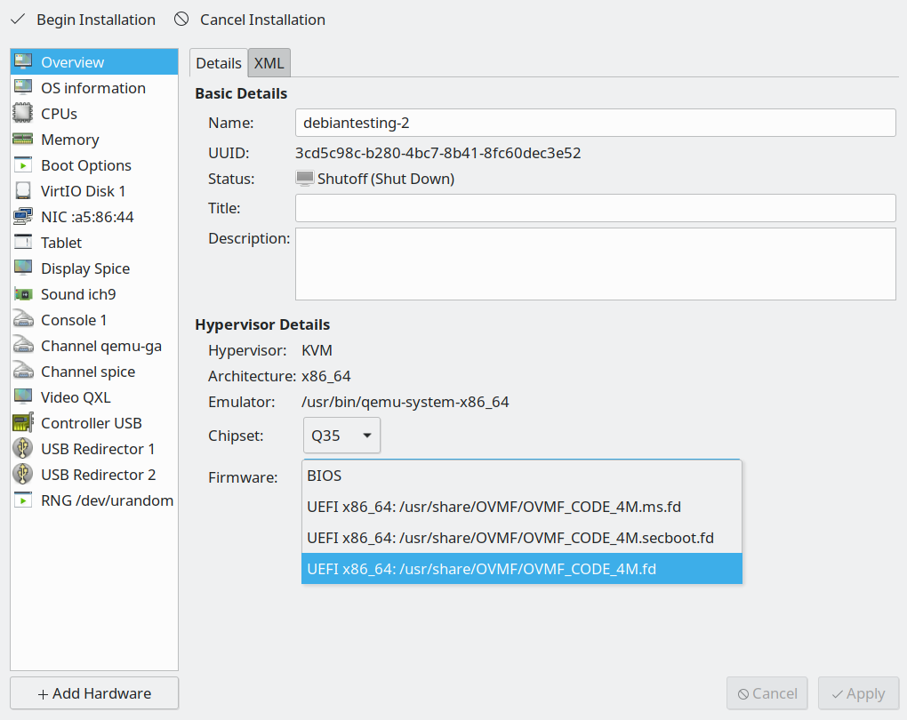
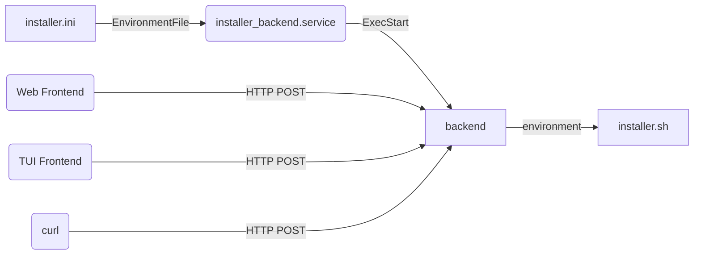
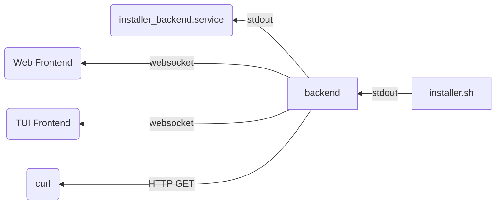

# Debian Btrfs Installer (Browser-based LiveCD)

Browser-driven Debian installer optimized for Btrfs + TPM, to be run from a Debian Live USB/CD. This fork focuses on a simple browser UI that drives `installer.sh` — no CLI/TUI required.

## Requirements

- UEFI boot (amd64)
- Debian Live environment (recommended)
- Internet access to fetch packages

## Quick Start (LiveCD)

1. Boot a Debian Live USB/CD (UEFI)
2. Open a terminal in this repo folder and run:

```bash
sudo ./run_livecd_installer.sh
```

This installs any missing tools, builds the UI/backend if sources are present, starts the backend on `http://localhost:5000`, and opens your browser. Fill the form and click Install. The script runs `installer.sh` under the hood.

## What It Installs

- Debian 13 (Trixie) with backports and non-free firmware
- Btrfs with subvolumes (`@`, `@home`; optional `@swap`) and optional Snapper
- Full-disk LUKS with optional TPM2 auto-unlock
- systemd-boot + dracut; NetworkManager

### Method 2: Build Your Own Installer Image (Advanced)

If you prefer to create a custom installer image:

1. Clone this repository
2. Edit the configuration variables
3. Run the image building scripts: `make_image_1.sh`, `make_image_2.sh`, `make_image_3.sh`

## New Features

This enhanced version includes:

- **🔄 Snapper Snapshots**: Automatic system snapshots using openSUSE's Snapper configuration
- **⚙️ sdbootutil Integration**: Enhanced systemd-boot management from openSUSE
- **🎨 Ubuntu Theme Option**: Apply Ubuntu's Yaru theme and fonts (without Flatpak)
- **📱 Direct LiveCD Usage**: No need to create custom installer images
- **🛡️ Enhanced Security**: Optional encryption with TPM2 auto-unlock

## Screencast & Screenshot

Screenshot of the full installer GUI:



Video of installation of Debian with KDE Plasma (Bookworm version):

[](https://youtu.be/sbnKvGMcagI?si=W9NvZygB8Z7-LCT8&t=92)

## Details

- **Disk Layout**: GPT partitions with UEFI ESP and encrypted root partition
- **Btrfs Subvolumes**: openSUSE-style layout optimized for Snapper:
  - `@` - Root filesystem
  - `@home` - User home directories  
  - `@snapshots` - Snapper snapshots storage
  - `@var` - Variable data
  - `@log` - System logs
  - `@swap` - Swap file (optional)
- **Snapper Integration**: Automatic snapshots with configurable retention policies
- **Enhanced Boot**: [systemd-boot](https://www.freedesktop.org/wiki/Software/systemd/systemd-boot/) with optional [sdbootutil](https://github.com/openSUSE/sdbootutil) integration
- **Modern Init**: [Dracut](https://github.com/dracutdevs/dracut/wiki/) instead of initramfs-tools
- **Network**: [NetworkManager](https://wiki.debian.org/NetworkManager) for networking
- **Security**: [LUKS encryption](https://cryptsetup-team.pages.debian.net/cryptsetup/README.Debian.html) with [TPM2 auto-unlock](https://www.freedesktop.org/software/systemd/man/systemd-cryptenroll.html#--tpm2-device=PATH)
- **User Management**: [Sudo](https://wiki.debian.org/sudo) configured for the created user 

## (Optional) Configuration, Automatic Installation

Edit [installer.ini](installer-files/boot/efi/installer.ini) on the first (vfat) partition of the installer image.
It will allow you to pre-seed and automate the installation.

If you edit it directly in the booted installer image, it is /boot/efi/installer.ini
Reboot after editing the file for the new values to take effect.

## Headless Installation

You can use the installer for server installation.

As a start, edit the configuration file installer.ini (see above), set option BACK_END_IP_ADDRESS to 0.0.0.0 and reboot the installer.
**There is no encryption or authentication in the communication so only do this on a trusted network.**

You have several options to access the installer. 
Assuming the IP address of the installed machine is 192.168.1.29 and you can reach it from your PC:

* Use the web interface in a browser on a PC - open `http://192.168.1.29/opinionated-debian-installer/`
* Use the text mode interface - start `opinionated-installer tui -baseUrl http://192.168.1.29:5000`
* Use curl - again, see the [installer.ini](installer-files/boot/efi/installer.ini) file for list of all options for the form data in -F parameters:

      curl -v -F "DISK=/dev/vda" -F "USER_PASSWORD=hunter2" \
      -F "ROOT_PASSWORD=changeme" -F "LUKS_PASSWORD=luke" \ 
      http://192.168.1.29:5000/install

* Use curl to prompt for logs:

      curl  http://192.168.1.29:5000/download_log

## Testing

If you are testing in a virtual machine, attaching the downloaded image file as a virtual disk, you need to extend it first.
The image file that you downloaded is shrunk, there is no free space left in the filesystems.
Use `truncate -s +500M opinionated*.img` to add 500MB to the virtual disk before you attach it to a virtual machine.
The installer will expand the partitions and filesystem to fill the device.

### Libvirt

To test with [libvirt](https://libvirt.org/), make sure to create the VM with UEFI:

1. Select the _Customize configuration before install_ option at the end of the new VM dialog
2. In the VM configuration window, _Overview_ tab, _Hypervisor Details_ section, select _Firmware_: _UEFI_



To add a TPM module, you need to install the [swtpm-tools](https://packages.debian.org/bookworm/swtpm-tools) package.

Attach the downloaded installer image file as _Device type: Disk device_, not ~~CDROM device~~.

### Hyper-V

To test with the MS hyper-v virtualization, make sure to create your VM with [Generation 2](https://learn.microsoft.com/en-us/windows-server/virtualization/hyper-v/plan/Should-I-create-a-generation-1-or-2-virtual-machine-in-Hyper-V). 
This will enable UEFI.
TPM can be enabled and Secure Boot disabled in the Security tab of the Hyper-V settings.

You will also need to convert the installer image to VHDx format and make the file not sparse.
You can use [qemu-img](https://www.qemu.org/docs/master/tools/qemu-img.html) ([windows download](https://qemu.weilnetz.de/w64/)) and fsutil like this:

    qemu-img convert -f raw -O vhdx opinionated-debian-installer-bookworm-kde-plasma-20230319a.img odin.vhdx
    fsutil sparse setflag odin.vhdx 0

Attach the generated VHDx file as a disk, not as a ~~CD~~.

## Hacking

Alternatively to running the whole browser based GUI, you can run the `installer.sh` script manually from a root shell.
The end result will be exactly the same.
Just don't forget to edit the configuration options (especially the `DISK` variable) before running it.

### Creating Your Own Installer Image

 1. Insert a blank storage device
 2. Edit the **DISK** variable at the top of files `make_image_*.sh`
 3. Execute the `make_image_*.sh` files as root

In the first stage of image generation, you will get a _tasksel_ prompt where you can select a different set of packages for your image.

### Installer Image Structure

There are 3 GPT partitions on the installer image:

 1. EFI boot partition
 2. Base Image - Btrfs partition with maximum zstd compression. 
    When the live system is running, this is used as a [read-only lower device for overlayfs](https://docs.kernel.org/filesystems/overlayfs.html). 
    When installing the target system, the installer will copy this to the target system, mount it read-write, resize to expand to the whole partition and continue with the system installation.
 3. Top Overlay - upper and work device for the overlayfs for the live system. The changes you make while the live system is running are persisted here.

### Building the Front-End

The front-end is a [vue](https://vuejs.org/) application. 
You need [npm](https://www.npmjs.com/) to build it.
Run the following commands to build it:

    cd frontend
    npm run build

### Building the HTTP Backend and the Text-User-Interface Frontend

The HTTP backend and TUI frontend is a [go](https://go.dev/) application.
Run the following commands to build it:

    cd frontend-tui
    go build -o opinionated-installer

### Configuration Flow



### Output Flow



## Credits

This project is based on:
- [r0b0's debian-installer](https://github.com/r0b0/debian-installer) - Original installer framework
- [openSUSE's sdbootutil](https://github.com/openSUSE/sdbootutil) - systemd-boot integration
- openSUSE's Btrfs layout and Snapper configuration  
- Ubuntu theme inspired by [DeltaLima's make-debian-look-like-ubuntu](https://github.com/DeltaLima/make-debian-look-like-ubuntu) - simplified version without Flatpak

## Features Comparison

| Feature                                 | This Installer | [Netinstall](https://www.debian.org/CD/netinst/) | [Calamares](https://get.debian.org/debian-cd/current-live/amd64/iso-hybrid/) |
|----------------------------------------|----------------|--------------------------------------------------|------------------------------------------------------------------------------|
| Browser-based installer                | ✅ **Yes**     | ❌ No                                            | ❌ No                                                                        |
| Btrfs with Snapper snapshots          | ✅ **Yes**     | ❌ No                                            | ❌ No                                                                        |
| TPM2 auto-unlock                      | ✅ **Yes**     | ❌ No                                            | ❌ No                                                                        |
| systemd-boot with sdbootutil          | ✅ **Yes**     | ❌ No                                            | ❌ No                                                                        |
| Direct LiveCD usage                   | ✅ **Yes**     | ❌ No                                            | ✅ Yes                                                                       |
| Full drive encryption                 | ✅ Yes         | ✅ Yes*                                          | ✅ Yes                                                                       |
| Non-free firmware & backports         | ✅ **Yes**     | ❌ No                                            | ❌ No                                                                        |
| Manual partitioning                   | ❌ No          | ✅ Yes                                           | ✅ Yes                                                                       |
| Multiple languages                    | ❌ No          | ✅ Yes                                           | ✅ Yes                                                                       |

*Requires separate unencrypted `/boot` partition

## License

MIT License - See [LICENSE](LICENSE) file

## Contributing

Contributions are welcome! Please ensure:
- Proper attribution for external code
- Test changes thoroughly  
- Document new features
