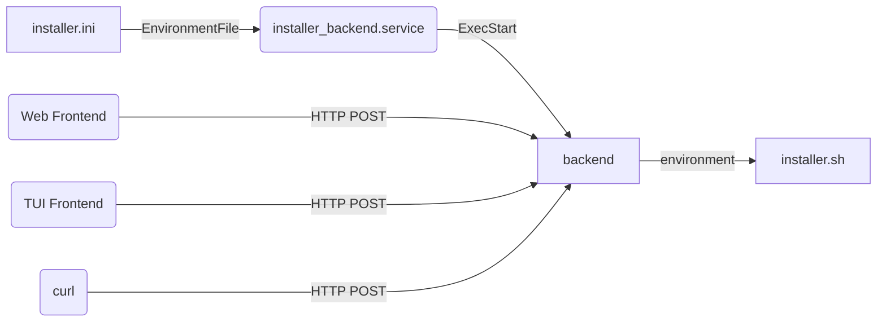
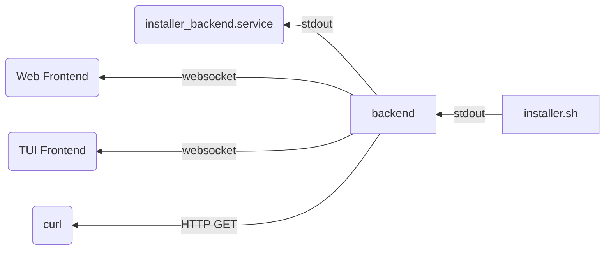

# Opinionated Debian Installer - ZFS Fork

**This is a fork of the [original Opinionated Debian Installer](https://github.com/r0b0/debian-installer) that replaces BTRFS with ZFS and adds boot environment management via [zectl](https://github.com/johnramsden/zectl).**

This tool can be used to create a modern installation of Debian. 
Our opinions of what a modern installation of Debian should look like in 2025 are:

 - Debian 13 (Trixie)
 - Backports and non-free enabled
 - Firmware installed
 - Installed on ZFS datasets with boot environment management via zectl
 - Optional ZFS native encryption (AES-256-GCM)
 - Fast installation using an image
 - Browser-based installer
  
## Limitations

 - **The installer will take over your whole disk**
 - Amd64 with EFI only
 - The installer is in english only

## Installation Methods

### Method 1: Use Official Debian Live CD (Recommended)
**No custom ISO build required!** Boot an official Debian Live CD and run the web installer:

1. Download [Debian Trixie GNOME Live CD](https://cdimage.debian.org/cdimage/weekly-live-builds/amd64/iso-hybrid/)
2. Boot the Live CD and run:
   ```bash
   curl -L https://raw.githubusercontent.com/Anonymo/debian-installer/master/livecd-quick-install.sh | bash
   ```
3. Or follow the manual steps in [LIVE_CD_WEB_INSTALLER.md](LIVE_CD_WEB_INSTALLER.md)

### Method 2: Build Custom Installer Image

**Note: Pre-built images are not yet available for this ZFS fork.**

1. Clone this repository:
   ```bash
   git clone https://github.com/Anonymo/debian-installer.git
   cd debian-installer
   ```

2. Follow the instructions in the [Creating Your Own Installer Image](#creating-your-own-installer-image) section below

## What's Different in This Fork

### ZFS Instead of BTRFS
- Uses ZFS datasets instead of BTRFS subvolumes
- ZFS pool named `rpool` with datasets:
  - `rpool/ROOT/debian` for the root filesystem
  - `rpool/home` for `/home`
  - `rpool/swap` for swap (zvol)
- Native ZFS compression (LZ4) and optimization
- ZFS TRIM support for SSDs

### Boot Environment Management with zectl
- Integrated [zectl](https://github.com/johnramsden/zectl) for managing boot environments
- Create snapshots before system updates
- Easily rollback to previous boot environments
- Compatible with systemd-boot

### Encryption Support
- **ZFS Native Encryption** (NEW) - AES-256-GCM encryption at the dataset level
- Encryption is completely optional
- No additional encryption layers needed
- Password prompt at boot for ZFS native encryption

### Additional Features
- Automatic ZFS module installation and configuration
- ZFS-optimized kernel parameters
- Boot environment snapshots for safe system updates
- APT hook for automatic boot environment creation before upgrades
- Web-based installer interface - no manual configuration needed

## Installation Instructions

1. Build the installer image (see [Creating Your Own Installer Image](#creating-your-own-installer-image))
2. Write the image file to a USB flash drive. **Do not use ventoy** or similar "clever" tools - they are not compatible with these images. If you need a GUI, use [etcher](https://github.com/balena-io/etcher/releases) or [win32DiskImager](https://sourceforge.net/projects/win32diskimager/files/Archive/) or just use dd - `dd if=opinionated-debian-installer*.img of=/dev/sdX bs=256M oflag=dsync status=progress` where sdX is your USB flash drive 
3. Boot from the USB flash drive
4. Start the installer icon from the desktop/dash, fill in the form in the browser and press the big _Install_ button
5. Reboot and enjoy your ZFS-based Debian system

## Details

- GPT disk partitions are created on the designated disk drive: 
  - UEFI ESP partition
  - Root partition - ZFS pool with optional native encryption
- ZFS pool is created directly on the partition
- GPT root partition is [auto-discoverable](https://www.freedesktop.org/software/systemd/man/systemd-gpt-auto-generator.html)
- ZFS datasets will be created as:
  - `rpool/ROOT/debian` for `/` (root filesystem)
  - `rpool/home` for `/home`
  - `rpool/swap` for swap (zvol)
- [zectl](https://github.com/johnramsden/zectl) is installed for boot environment management
- Boot environments allow easy rollback if system updates cause issues
- The system is installed using an image from the live iso. This will speed up the installation significantly and allow off-line installation.
- [Dracut](https://github.com/dracutdevs/dracut/wiki/) is used instead of initramfs-tools
- [Systemd-boot](https://www.freedesktop.org/wiki/Software/systemd/systemd-boot/) is used instead of grub
- [Network-manager](https://wiki.debian.org/NetworkManager) is used for networking
- [Systemd-cryptenroll](https://www.freedesktop.org/software/systemd/man/systemd-cryptenroll.html#--tpm2-device=PATH) is used to unlock the disk, using TPM (if available)
- [Sudo](https://wiki.debian.org/sudo) is installed and configured for the created user 

## (Optional) Configuration, Automatic Installation

Edit [installer.ini](installer-files/boot/efi/installer.ini) on the first (vfat) partition of the installer image.
It will allow you to pre-seed and automate the installation.

If you edit it directly in the booted installer image, it is /boot/efi/installer.ini
Reboot after editing the file for the new values to take effect.

## Headless Installation

You can use the installer for server installation.

As a start, edit the configuration file installer.ini (see above), set option BACK_END_IP_ADDRESS to 0.0.0.0 and reboot the installer.
**There is no encryption or authentication in the communication so only do this on a trusted network.**

You have several options to access the installer. 
Assuming the IP address of the installed machine is 192.168.1.29 and you can reach it from your PC:

* Use the web interface in a browser on a PC - open `http://192.168.1.29/opinionated-debian-installer/`
* Use the text mode interface - start `opinionated-installer tui -baseUrl http://192.168.1.29:5000`
* Use curl - again, see the [installer.ini](installer-files/boot/efi/installer.ini) file for list of all options for the form data in -F parameters:

      curl -v -F "DISK=/dev/vda" -F "USER_PASSWORD=hunter2" \
      -F "ROOT_PASSWORD=changeme" -F "ENCRYPTION_PASSWORD=secret" \ 
      http://192.168.1.29:5000/install

* Use curl to prompt for logs:

      curl  http://192.168.1.29:5000/download_log

## Testing

**⚠️ Note: Testing for this ZFS fork is pending. The instructions below are from the original BTRFS version and may need adjustments for ZFS.**

If you are testing in a virtual machine, attaching the downloaded image file as a virtual disk, you need to extend it first.
The image file that you downloaded is shrunk, there is no free space left in the filesystems.
Use `truncate -s +500M opinionated*.img` to add 500MB to the virtual disk before you attach it to a virtual machine.
The installer will expand the partitions and filesystem to fill the device.

### Libvirt

To test with [libvirt](https://libvirt.org/), make sure to create the VM with UEFI:

1. Select the _Customize configuration before install_ option at the end of the new VM dialog
2. In the VM configuration window, _Overview_ tab, _Hypervisor Details_ section, select _Firmware_: _UEFI_


To add a TPM module, you need to install the [swtpm-tools](https://packages.debian.org/trixie/swtpm-tools) package.

Attach the downloaded installer image file as _Device type: Disk device_, not ~~CDROM device~~.

### Hyper-V

To test with the MS hyper-v virtualization, make sure to create your VM with [Generation 2](https://learn.microsoft.com/en-us/windows-server/virtualization/hyper-v/plan/Should-I-create-a-generation-1-or-2-virtual-machine-in-Hyper-V). 
This will enable UEFI.
TPM can be enabled and Secure Boot disabled in the Security tab of the Hyper-V settings.

You will also need to convert the installer image to VHDx format and make the file not sparse.
You can use [qemu-img](https://www.qemu.org/docs/master/tools/qemu-img.html) ([windows download](https://qemu.weilnetz.de/w64/)) and fsutil like this:

    qemu-img convert -f raw -O vhdx opinionated-debian-installer-*.img odin.vhdx
    fsutil sparse setflag odin.vhdx 0

Attach the generated VHDx file as a disk, not as a ~~CD~~.

## Hacking

Alternatively to running the whole browser based GUI, you can run the `installer.sh` script manually from a root shell.
The end result will be exactly the same.
Just don't forget to edit the configuration options (especially the `DISK` variable) before running it.

### Creating Your Own Installer Image

 1. Install required build dependencies:
    ```bash
    apt-get install debootstrap zfsutils-linux npm golang
    ```
 2. Build the frontend and backend:
    ```bash
    cd frontend && npm install && npm run build && cd ..
    cd backend && go build -o opinionated-installer && cd ..
    ```
 3. Insert a blank storage device
 4. Edit the **DISK** variable at the top of files `make_image_*.sh`
 5. Execute the `make_image_*.sh` files as root:
    ```bash
    sudo ./make_image_1.sh
    # Follow prompts, then power off and add 500MB to disk
    sudo ./make_image_2.sh
    # Reboot when prompted
    sudo ./make_image_3.sh
    ```

In the first stage of image generation, you will get a _tasksel_ prompt where you can select a different set of packages for your image.

### Installer Image Structure

There are 3 GPT partitions on the installer image:

 1. EFI boot partition
 2. Base Image - ZFS pool with LZ4 compression
    - When the live system is running, this is used as a [read-only lower device for overlayfs](https://docs.kernel.org/filesystems/overlayfs.html)
    - When installing the target system, the installer will copy this to the target system, mount it read-write, and continue with the system installation
 3. Top Overlay - ZFS pool for the upper and work device for the overlayfs for the live system. The changes you make while the live system is running are persisted here

### Building the Front-End

The front-end is a [vue](https://vuejs.org/) application. 
You need [npm](https://www.npmjs.com/) to build it.
Run the following commands to build it:

    cd frontend
    npm run build

### Building the HTTP Backend and the Text-User-Interface Frontend

The HTTP backend and TUI frontend is a [go](https://go.dev/) application.
Run the following commands to build it:

    cd backend
    go build -o opinionated-installer

### Configuration Flow



### Output Flow



## Comparison

The following table contains comparison of features between our opinionated debian installer and official debian installers.

| Feature                                             | ODIN  | [Netinstall](https://www.debian.org/CD/netinst/) | [Calamares](https://get.debian.org/debian-cd/current-live/amd64/iso-hybrid/) |
|-----------------------------------------------------|-------|--------------------------------------------------|------------------------------------------------------------------------------|
| Installer internationalization                      | N     | Y                                                | Y                                                                            |
| Mirror selection, HTTP proxy support                | N     | Y                                                | N                                                                            |
| Manual disk partitioning, LVM, filesystem selection | N[4]  | Y                                                | Y                                                                            |
| ZFS datasets with boot environments                 | **Y**[2] | N                                                | N                                                                            |
| Full drive encryption                               | **Y** | Y[1]                                             | Y                                                                            |
| Passwordless unlock (TPM)                           | **Y** | N                                                | N                                                                            |
| Image-based installation                            | **Y** | N                                                | N                                                                            |
| Non-free and backports                              | **Y** | N                                                | N                                                                            |
| Browser-based installer                             | **Y** | N                                                | N                                                                            |

[1] `/boot` needs a separate unencrypted partition

[2] `rpool/ROOT/debian` and `rpool/home` with zectl boot environment management

[3] `@rootfs`

[4] Fixed partitioning (see Details above), ZFS native encryption is optional
